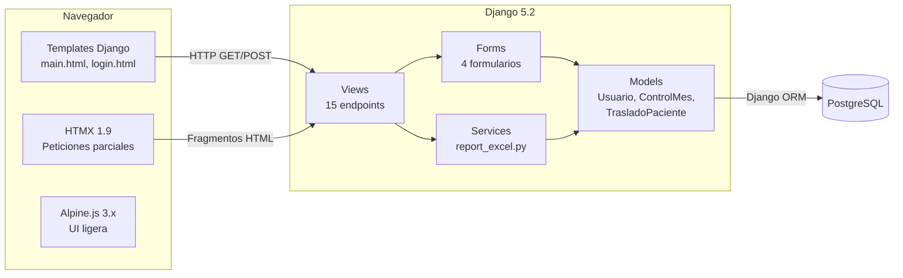
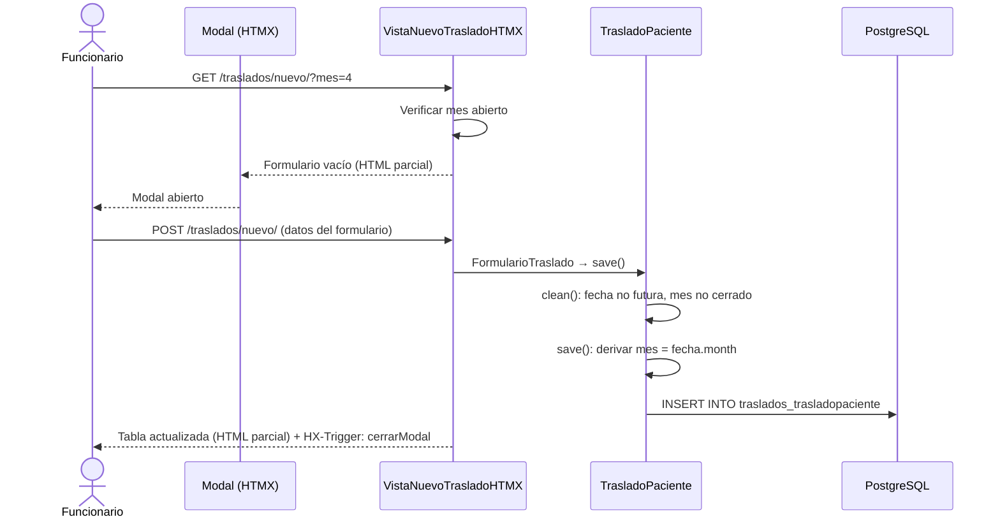
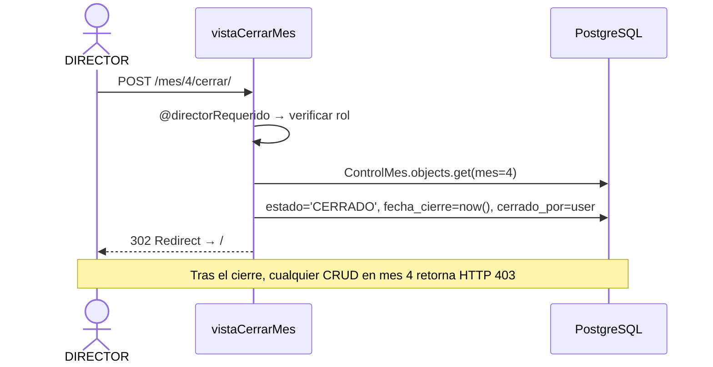
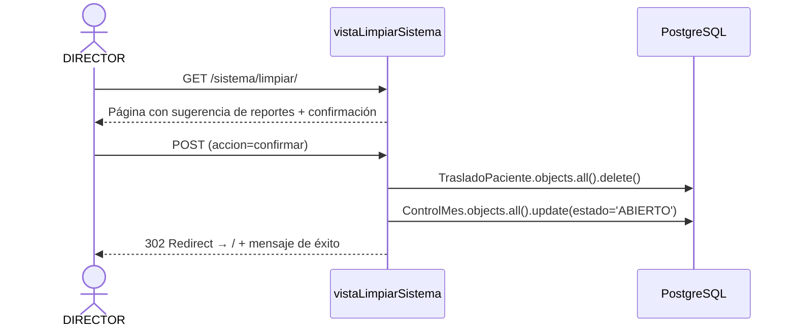
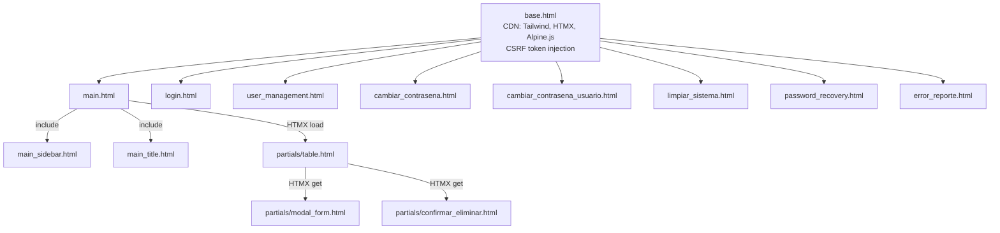
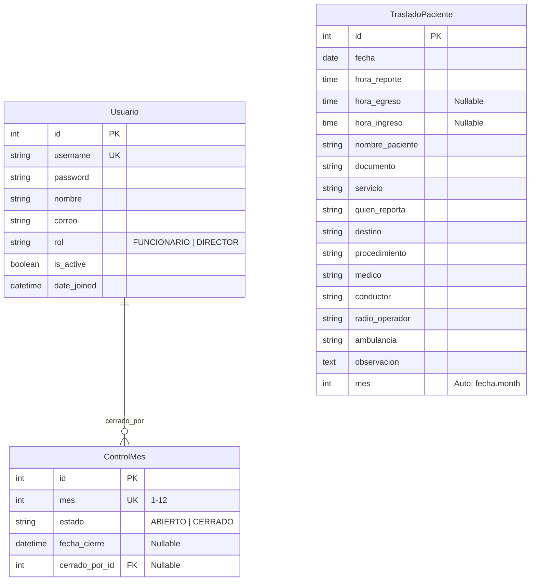

# Informe Final — CRUE Traslados Pacientes

**Sistema de registro y gestión de servicios de traslado de pacientes**

---

- **Autor**: Luis Ernesto Garreta Unigarro
- **Fecha**: 30 de Abril del 2026

## Tabla de Contenidos

1. [Resumen Ejecutivo](#1-resumen-ejecutivo)
2. [Características Principales](#2-características-principales)
3. [Stack Tecnológico](#3-stack-tecnológico)
4. [Arquitectura del Sistema](#4-arquitectura-del-sistema)
5. [Modelo de Datos](#5-modelo-de-datos)
6. [Endpoints del Sistema](#6-endpoints-del-sistema)
7. [Guía de Usuario — Resumen Operativo](#7-guía-de-usuario--resumen-operativo)
8. [Despliegue y Configuración](#8-despliegue-y-configuración)
9. [Estado Actual y Changelog](#9-estado-actual-y-changelog)

---

## 1. Resumen Ejecutivo

### ¿Qué es CRUE Traslados?

CRUE Traslados es un sistema web de registro de servicios de traslado de pacientes diseñado para el Hospital Universitario Departamental de Nariño (HUDN). Funciona como un registro centralizado donde los funcionarios documentan cada traslado de paciente, incluyendo datos de identificación, tiempos de reporte/egreso/ingreso, servicio de origen, destino, procedimiento, personal involucrado (médico, conductor, radio operador) y ambulancia utilizada.

### Problema que resuelve

El proceso de registro de traslados de pacientes se realizaba manualmente en hojas de cálculo Excel, lo que generaba problemas de consistencia, dificultad para consultar registros por período, falta de control sobre el cierre mensual de registros y ausencia de control de acceso. CRUE Traslados digitaliza este proceso proporcionando un sistema web con validaciones automáticas, control de acceso por roles, exportación Excel, control de cierre mensual y limpieza anual de datos.

### ¿Para quién es?

| Rol | Descripción | Interacción |
|---|---|---|
| **Funcionario** | Personal operativo | Registra, consulta, edita y elimina traslados (en meses abiertos). Exporta a Excel. Cambia su contraseña. |
| **Director** | Administrador del sistema | Todas las funciones del Funcionario + gestión de usuarios, cierre de mes y limpieza anual de datos. |
| **Administrador técnico** | Responsable de infraestructura | Configura base de datos, variables de entorno, despliegue y backups. |

### Principios de diseño

- **Control mensual**: Cada mes puede ser cerrado por el DIRECTOR, protegiendo los registros contra modificaciones.
- **Sin datos históricos entre períodos**: El sistema no conserva datos entre períodos operativos. El DIRECTOR ejecuta la limpieza anual cuando se requiere reiniciar.
- **Derivación automática del mes**: El campo `mes` se calcula automáticamente a partir de la fecha del registro.
- **Validación en capa de modelo**: Las reglas de negocio (fecha no futura, mes no cerrado) se validan en el modelo Django, independiente de la interfaz.
- **Actualizaciones sin recarga**: HTMX maneja las operaciones CRUD sin recargar la página completa.

---

## 2. Características Principales

### 2.1 Tabla de Traslados (Vista Principal)

Tabla estilo hoja de cálculo que muestra los registros filtrados del período seleccionado.

- Filtrado por **mes** (selector con nombres en español) y **rango de días** (Día Desde / Día Hasta).
- Indicador visual del estado del mes: **ABIERTO** (verde) o **CERRADO** (rojo).
- 16 columnas: Acciones, Fecha, Hora Reporte, Hora de Egreso, Hora de Ingreso, Nombre de Paciente, Documento, Servicio, Quien Reporta, Destino, Procedimiento, Médico, Conductor, Radio Operador, Ambulancia de Traslado, Observación.
- Botones de acción por fila: editar (✏️) y eliminar (🗑️), deshabilitados cuando el mes está cerrado.
- Doble clic sobre una fila abre el modal de edición (si el mes está abierto).
- Actualización dinámica vía HTMX sin recarga de página.

### 2.2 Modal de Creación/Edición

Diálogo modal con formulario completo para crear y editar traslados.

- Widget de fecha nativo (`<input type="date">`).
- Campos de hora en formato texto `HH:MM` con patrón de validación.
- Campos obligatorios marcados con asterisco rojo (*): Fecha, Hora Reporte, Nombre de Paciente, Documento.
- Validación servidor: fecha no puede ser futura, mes no puede estar cerrado.
- Disposición en grilla de 2 columnas para campos relacionados.
- Botones: Guardar y Cancelar.

### 2.3 Exportación a Excel

- Genera archivo `.xlsx` con los 15 campos del traslado.
- Encabezados en español en la primera fila.
- Respeta el filtro activo (mes y rango de días).
- Nombre de archivo: `traslados_<mes>.xlsx`.
- Si no hay registros, genera archivo con solo encabezados.

### 2.4 Control de Cierre de Mes (solo Director)

- El DIRECTOR puede cerrar el mes seleccionado desde la barra de filtros.
- Un mes cerrado bloquea toda operación CRUD sobre sus registros (crear, editar, eliminar).
- El bloqueo se aplica tanto en la interfaz (botones deshabilitados) como en el servidor (HTTP 403).
- No existe operación de reapertura individual. La limpieza anual restablece todos los meses.

### 2.5 Gestión de Usuarios (solo Director)

- Crear usuarios con nombre de usuario, contraseña inicial y rol (FUNCIONARIO o DIRECTOR).
- Cambiar contraseña de cualquier usuario (sin requerir la contraseña actual).
- Eliminar usuarios (excepto el propio).
- Listado de todos los usuarios con su rol.

### 2.6 Limpieza Anual de Datos (solo Director)

- Sugiere descargar el reporte Excel antes de proceder.
- Diálogo de confirmación con advertencia de acción irreversible.
- Al confirmar: elimina todos los registros de traslados y restablece todos los meses a ABIERTO.

### 2.7 Validaciones Implementadas

| Validación | Descripción |
|---|---|
| Fecha no futura | La fecha del traslado no puede ser posterior al día actual |
| Mes cerrado | No se permiten operaciones CRUD en meses con estado CERRADO |
| Campos obligatorios | Fecha, Hora Reporte, Nombre de Paciente, Documento |
| Mes futuro en filtro | No se permite seleccionar un mes posterior al mes actual |
| Rango de días válido | Día Desde ≤ Día Hasta, ambos dentro del rango del mes |
| Username único | No se permite crear usuarios con nombre duplicado |
| Confirmación de contraseña | Nueva contraseña y confirmación deben coincidir |
| Recuperación segura | Mensaje genérico sin revelar si el usuario existe |

---

## 3. Stack Tecnológico

| Componente | Tecnología | Propósito |
|---|---|---|
| Backend | Django 5.2.4 (SSR con templates) | Framework web, ORM, autenticación |
| Base de datos | PostgreSQL 16+ | Almacenamiento persistente con integridad referencial |
| Frontend dinámico | HTMX 1.9.12 | Actualizaciones parciales sin recarga de página |
| UI ligera | Alpine.js 3.x | Menús colapsables, modales, interacciones mínimas |
| Estilos | Tailwind CSS (CDN) | Diseño responsive sin build step |
| Iconos | Bootstrap Icons (CDN) | Iconos de acciones y navegación |
| Exportación | openpyxl 3.1.5 | Generación de archivos Excel |
| Variables de entorno | python-dotenv 1.1.0 | Carga de credenciales desde `.env` |
| Adaptador BD | psycopg2-binary 2.9.10 | Conexión Django ↔ PostgreSQL |

### Decisiones técnicas clave

- **SSR + HTMX sobre SPA**: Django renderiza HTML completo. HTMX maneja las actualizaciones parciales (tabla, modales) vía atributos `hx-get`/`hx-post`. No hay framework JS pesado ni API REST separada.
- **Alpine.js sobre JavaScript personalizado**: Los comportamientos de UI (menús colapsables, cierre de modales con ESC) se resuelven con Alpine.js declarativo, minimizando el JS personalizado.
- **JavaScript vanilla mínimo**: Solo para doble clic en filas de tabla y toast de errores HTMX (`main.js`).
- **Tailwind CSS por CDN**: Para el MVP no se requiere build step. En producción se recomienda servir archivos estáticos localmente.
- **PostgreSQL sobre SQLite**: Integridad referencial, soporte de concurrencia y compatibilidad con despliegue en producción.
- **Modelo Usuario personalizado**: `Usuario` extiende `AbstractUser` con campos `nombre`, `correo` y `rol`, eliminando la necesidad de un modelo `Perfil` separado.

---

## 4. Arquitectura del Sistema

### 4.1 Visión General

CRUE Traslados sigue una arquitectura **Server-Side Rendering (SSR)** con Django Templates y comunicación HTMX para las operaciones CRUD.



### 4.2 Estructura del Proyecto

```
app_crue_traslados/
├── config/                          # Configuración Django
│   ├── settings.py                  # PostgreSQL, timezone America/Bogota
│   ├── urls.py                      # URLs raíz (admin, login, logout, app)
│   └── wsgi.py                      # Punto de entrada WSGI
├── traslados/                       # Aplicación principal
│   ├── models.py                    # Usuario + ControlMes + TrasladoPaciente
│   ├── views.py                     # 15 vistas (CBV + FBV)
│   ├── forms.py                     # 4 formularios Django
│   ├── urls.py                      # 15 rutas URL
│   ├── admin.py                     # Admin Django (3 modelos)
│   ├── apps.py                      # Config + post_migrate (inicializar meses)
│   ├── services/
│   │   └── report_excel.py          # Generación de reportes Excel
│   ├── management/commands/
│   │   └── inicializar_meses.py     # Comando: crear 12 ControlMes
│   ├── templates/traslados/
│   │   ├── base.html                # Base (CDN, CSRF, bloques)
│   │   ├── main.html                # Vista principal
│   │   ├── main_sidebar.html        # Panel lateral
│   │   ├── main_title.html          # Barra de título con logo
│   │   ├── login.html               # Inicio de sesión
│   │   ├── partials/
│   │   │   ├── table.html           # Tabla de registros (HTMX)
│   │   │   ├── modal_form.html      # Modal crear/editar (HTMX)
│   │   │   ├── confirmar_eliminar.html
│   │   │   └── confirmar_eliminar_usuario.html
│   │   ├── user_management.html
│   │   ├── cambiar_contrasena.html
│   │   ├── cambiar_contrasena_usuario.html
│   │   ├── limpiar_sistema.html
│   │   ├── password_recovery.html
│   │   └── error_reporte.html
│   ├── static/traslados/
│   │   ├── css/estilos.css
│   │   ├── js/main.js               # Doble clic + toast errores
│   │   └── img/logos/
│   └── tests/                       # Tests unitarios y de propiedad
├── docs/                            # Documentación (7 archivos)
├── manage.py
├── requirements.txt
└── .env                             # Variables de entorno (no versionado)
```

### 4.3 Flujo Principal: Crear un Traslado



### 4.4 Flujo: Cierre de Mes



### 4.5 Flujo: Limpieza Anual



### 4.6 Relación de Templates



---

## 5. Modelo de Datos

### 5.1 Diagrama Entidad-Relación



### 5.2 Usuario

Extiende `AbstractUser` de Django. Hereda todos los campos estándar (username, password, is_active, etc.) y agrega:

| Campo | Tipo | Requerido | Default | Descripción |
|---|---|---|---|---|
| `nombre` | CharField(255) | No | `''` | Nombre completo del usuario |
| `correo` | EmailField | No | `''` | Correo electrónico |
| `rol` | CharField(20) | Sí | `'FUNCIONARIO'` | `FUNCIONARIO` o `DIRECTOR` |

### 5.3 ControlMes

Almacena el estado de apertura/cierre de cada mes (1–12). Las 12 filas se crean automáticamente tras cada migración.

| Campo | Tipo | Restricciones | Descripción |
|---|---|---|---|
| `mes` | IntegerField | `unique=True` | Número del mes (1–12) |
| `estado` | CharField(10) | choices: ABIERTO, CERRADO | Estado del mes |
| `fecha_cierre` | DateTimeField | `null=True` | Fecha/hora en que se cerró |
| `cerrado_por` | FK → Usuario | `null=True, on_delete=SET_NULL` | Usuario que cerró el mes |

### 5.4 TrasladoPaciente

Entidad principal: un registro de servicio de traslado de paciente.

| Campo | Tipo | Requerido | Descripción |
|---|---|---|---|
| `fecha` | DateField | Sí | Fecha del traslado (no puede ser futura) |
| `hora_reporte` | TimeField | Sí | Hora en que se reportó |
| `hora_egreso` | TimeField | No | Hora de egreso del paciente |
| `hora_ingreso` | TimeField | No | Hora de ingreso del paciente |
| `nombre_paciente` | CharField(255) | Sí | Nombre completo del paciente |
| `documento` | CharField(50) | Sí | Documento de identidad |
| `servicio` | CharField(100) | Sí | Servicio de origen |
| `quien_reporta` | CharField(100) | Sí | Persona que reporta |
| `destino` | CharField(100) | Sí | Destino del traslado |
| `procedimiento` | CharField(255) | Sí | Procedimiento o motivo |
| `medico` | CharField(100) | Sí | Médico responsable |
| `conductor` | CharField(100) | Sí | Conductor de la ambulancia |
| `radio_operador` | CharField(100) | Sí | Radio operador |
| `ambulancia` | CharField(100) | Sí | Identificación de la ambulancia |
| `observacion` | TextField | No | Observaciones adicionales |
| `mes` | IntegerField | Auto | Derivado de `fecha.month` (no editable) |

**Índices**: `mes`, `fecha`.
**Ordenamiento**: `['fecha', 'hora_reporte']`.
**Validaciones en `clean()`**: fecha no futura + mes no cerrado.

---

## 6. Endpoints del Sistema

### URLs del proyecto (config/urls.py)

| Método | Ruta | Nombre | Descripción |
|---|---|---|---|
| GET | `/admin/` | — | Panel de administración Django |
| GET, POST | `/login/` | `login` | Inicio de sesión |
| POST | `/logout/` | `logout` | Cierre de sesión |

### URLs de la aplicación (traslados/urls.py)

| Método | Ruta | Nombre | Acceso | Descripción |
|---|---|---|---|---|
| GET | `/` | `principal` | Autenticado | Vista principal con filtros y tabla |
| GET, POST | `/recuperar-contrasena/` | `recuperar-contrasena` | Público | Recuperación de contraseña |
| GET | `/traslados/tabla/` | `tabla-traslados` | Autenticado | Partial HTMX: tabla filtrada |
| GET, POST | `/traslados/nuevo/` | `traslado-nuevo` | Autenticado | Modal crear traslado (HTMX) |
| GET, POST | `/traslados/<pk>/editar/` | `traslado-editar` | Autenticado | Modal editar traslado (HTMX) |
| GET | `/traslados/<pk>/confirmar-eliminar/` | `traslado-confirmar-eliminar` | Autenticado | Diálogo confirmación (HTMX) |
| DELETE | `/traslados/<pk>/eliminar/` | `traslado-eliminar` | Autenticado | Eliminar traslado (HTMX) |
| GET | `/reportes/excel/` | `reporte-excel` | Autenticado | Descargar Excel (.xlsx) |
| GET, POST | `/perfil/contrasena/` | `cambiar-contrasena` | Autenticado | Cambiar contraseña propia |
| GET | `/usuarios/` | `usuarios` | DIRECTOR | Listado de usuarios |
| GET, POST | `/usuarios/nuevo/` | `usuario-nuevo` | DIRECTOR | Crear usuario |
| GET, POST | `/usuarios/<pk>/contrasena/` | `usuario-contrasena` | DIRECTOR | Cambiar contraseña de usuario |
| GET, POST | `/usuarios/<pk>/eliminar/` | `usuario-eliminar` | DIRECTOR | Eliminar usuario |
| GET, POST | `/sistema/limpiar/` | `limpiar-sistema` | DIRECTOR | Limpieza anual de datos |
| POST | `/mes/<mes>/cerrar/` | `cerrar-mes` | DIRECTOR | Cerrar mes |

### Parámetros de filtro (query string)

Aplican a `/`, `/traslados/tabla/` y `/reportes/excel/`:

| Parámetro | Tipo | Default | Descripción |
|---|---|---|---|
| `mes` | int (1–12) | Mes actual | Mes a filtrar |
| `dia_desde` | int (1–31) | 1 | Día inicial del rango |
| `dia_hasta` | int (1–31) | Último día del mes | Día final del rango |

### Códigos de respuesta especiales

| Código | Contexto | Significado |
|---|---|---|
| 403 | CRUD en mes cerrado | Operación bloqueada por cierre de mes |
| 403 | Vistas de DIRECTOR | Usuario no tiene rol DIRECTOR |
| 404 | Editar/eliminar | Registro o usuario no encontrado |
| 405 | Cerrar mes | Método no permitido (solo POST) |
| HX-Trigger | Guardar/eliminar exitoso | `cerrarModal` — cierra el modal en el cliente |

---

## 7. Guía de Usuario — Resumen Operativo

### Flujo de trabajo diario del Funcionario

1. **Inicio de jornada**: Acceder al sistema e iniciar sesión con usuario y contraseña.
2. **Registrar traslados**: Clic en **[+] Adicionar** → completar formulario → **Guardar**. La fecha se pre-llena con el día actual.
3. **Consultar registros**: Usar el selector de mes (nombres en español) y el rango de días. La tabla se actualiza automáticamente.
4. **Editar registros**: Clic en el botón de editar (✏️) o doble clic sobre la fila → modificar campos → **Guardar**.
5. **Eliminar registros**: Clic en el botón de eliminar (🗑️) → confirmar en el diálogo.
6. **Exportar**: En el sidebar, abrir **Reportes > Excel** para descargar los registros del filtro activo.
7. **Cambiar contraseña**: Sidebar → **Gestión > Contraseña**.

### Flujo de trabajo del Director

Todo lo anterior, más:

1. **Cerrar un mes**: Seleccionar el mes en el filtro → clic en **Cerrar mes**. Los registros de ese mes quedan protegidos.
2. **Gestionar usuarios**: Sidebar → **Gestión > Usuarios**. Crear, cambiar contraseña o eliminar usuarios.
3. **Limpieza anual**: Sidebar → **Limpiar datos del sistema**. Descargar reportes primero, luego confirmar la limpieza.

### Restricciones de mes cerrado

- Los botones Adicionar, Editar y Eliminar se deshabilitan (gris).
- El doble clic sobre filas se ignora silenciosamente.
- Cualquier intento de operación desde el servidor retorna HTTP 403.

### Recuperación de contraseña

- En la pantalla de login → **Recuperar Contraseña** → ingresar nombre de usuario.
- El sistema muestra un mensaje genérico indicando contactar al DIRECTOR (sin revelar si el usuario existe).

---

## 8. Despliegue y Configuración

### 8.1 Prerrequisitos

- Python 3.12+
- PostgreSQL 16+
- pip

### 8.2 Instalación

```bash
git clone <url-del-repositorio>
cd app_crue_traslados
python -m venv venv
source venv/bin/activate
pip install -r requirements.txt
```

### 8.3 Variables de Entorno

Archivo `.env` en la raíz del proyecto (cargado por `python-dotenv`):

| Variable | Requerida | Default | Descripción |
|---|---|---|---|
| `DB_NAME` | Sí | `traslados_db` | Nombre de la base de datos |
| `DB_USER` | Sí | `postgres` | Usuario de PostgreSQL |
| `DB_PASSWORD` | Sí | (vacío) | Contraseña de PostgreSQL |
| `DB_HOST` | No | `127.0.0.1` | Host del servidor |
| `DB_PORT` | No | `5432` | Puerto del servidor |

### 8.4 Configuración de PostgreSQL

```sql
CREATE DATABASE crue_traslados_db;
-- (Opcional) Crear usuario dedicado:
CREATE USER traslados_user WITH PASSWORD 'contraseña_segura';
GRANT ALL PRIVILEGES ON DATABASE crue_traslados_db TO traslados_user;
```

### 8.5 Migraciones y Arranque

```bash
python manage.py migrate              # Aplica migraciones (crea 12 ControlMes automáticamente)
python manage.py createsuperuser       # Crear usuario administrador
python manage.py runserver             # Desarrollo
gunicorn config.wsgi:application       # Producción
```

### 8.6 Checklist de Producción

| Item | Acción requerida |
|---|---|
| `DEBUG` | Cambiar a `False` |
| `SECRET_KEY` | Generar clave secreta única, mover a variable de entorno |
| `ALLOWED_HOSTS` | Restringir a dominios/IPs del servidor |
| HTTPS | Configurar SSL/TLS |
| Archivos estáticos | Ejecutar `python manage.py collectstatic` |
| CDN local | Descargar Tailwind, HTMX, Alpine.js y Bootstrap Icons para servir localmente |
| Servidor WSGI | Usar gunicorn (no `runserver`) |
| Proxy inverso | Configurar nginx para estáticos + proxy a gunicorn |
| Backups | Configurar respaldos automáticos de BD (`pg_dump`) |
| Seguridad | Activar `SESSION_COOKIE_SECURE`, `CSRF_COOKIE_SECURE`, `X_FRAME_OPTIONS` |

---

## 9. Estado Actual y Changelog

### Versión actual: v2.0

El sistema se encuentra en estado funcional completo, preparado para despliegue en producción.

### Historial de versiones

| Fecha | Versión | Cambios |
|---|---|---|
| May 2, 2026 | **v2.0** | Modelo Usuario personalizado (reemplaza User + Perfil). Migración a PostgreSQL. Eliminación de funcionalidad PDF. Selector de mes con nombres en español. Documentación técnica completa (7 documentos). |
| Abr 2026 | **v1.0** | Primera versión funcional: CRUD de traslados, autenticación con roles, filtros por mes y rango de días, exportación Excel y PDF, control de cierre de mes, gestión de usuarios, cambio de contraseña, limpieza anual, recuperación de contraseña. |

### Funcionalidades implementadas

- ✅ Registro completo de traslados (CRUD) con 15 campos
- ✅ Control de acceso por roles (DIRECTOR / FUNCIONARIO)
- ✅ Modelo Usuario personalizado (AbstractUser + nombre, correo, rol)
- ✅ Control de cierre mensual con trazabilidad (quién cerró, cuándo)
- ✅ Exportación a Excel con encabezados en español
- ✅ Filtros por mes (nombres en español) y rango de días
- ✅ Validación de fecha no futura y mes cerrado (capa de modelo)
- ✅ Actualizaciones HTMX sin recarga de página (tabla, modales)
- ✅ Doble clic para editar registros
- ✅ Toast de notificación para errores HTMX
- ✅ Gestión completa de usuarios (crear, cambiar contraseña, eliminar)
- ✅ Cambio de contraseña propia con verificación de contraseña actual
- ✅ Recuperación de contraseña segura (sin revelar existencia de usuario)
- ✅ Limpieza anual con sugerencia de reportes y confirmación
- ✅ Inicialización automática de 12 ControlMes (post_migrate)
- ✅ Logo institucional HUDN
- ✅ Base de datos PostgreSQL con variables de entorno
- ✅ Suite de tests unitarios y de propiedad (Hypothesis)
- ✅ Documentación técnica completa (7 documentos)
