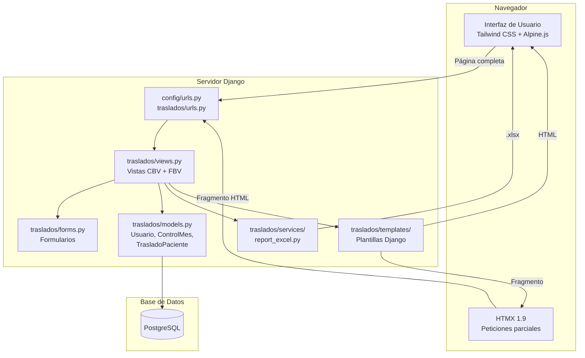
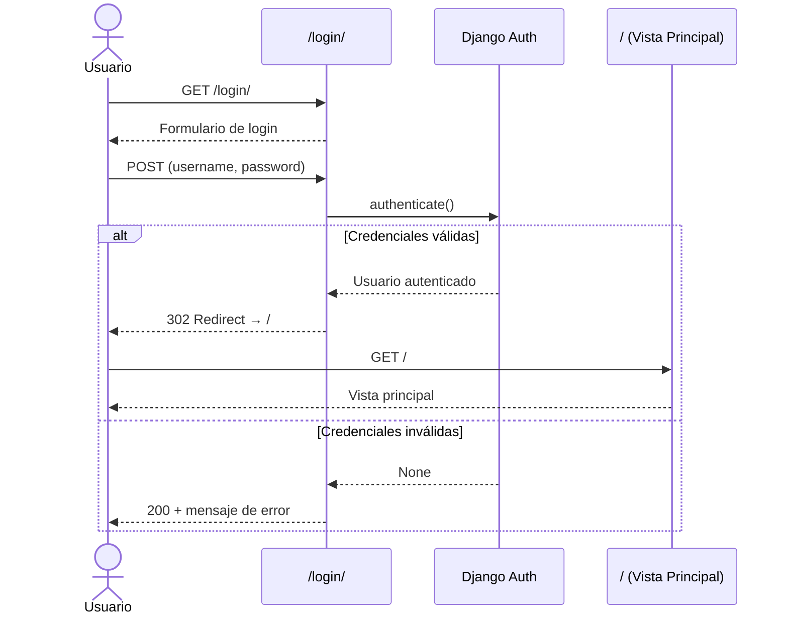
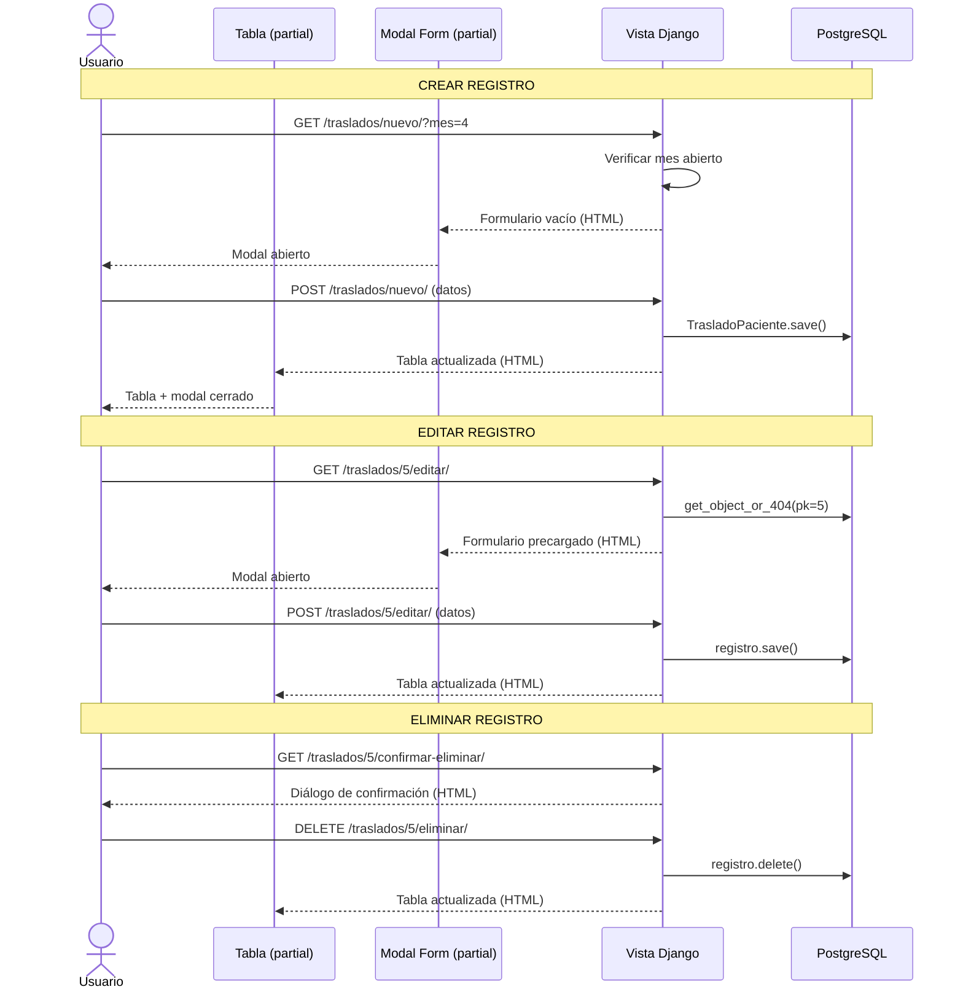
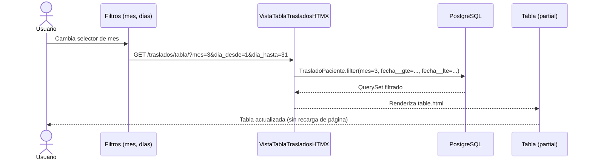
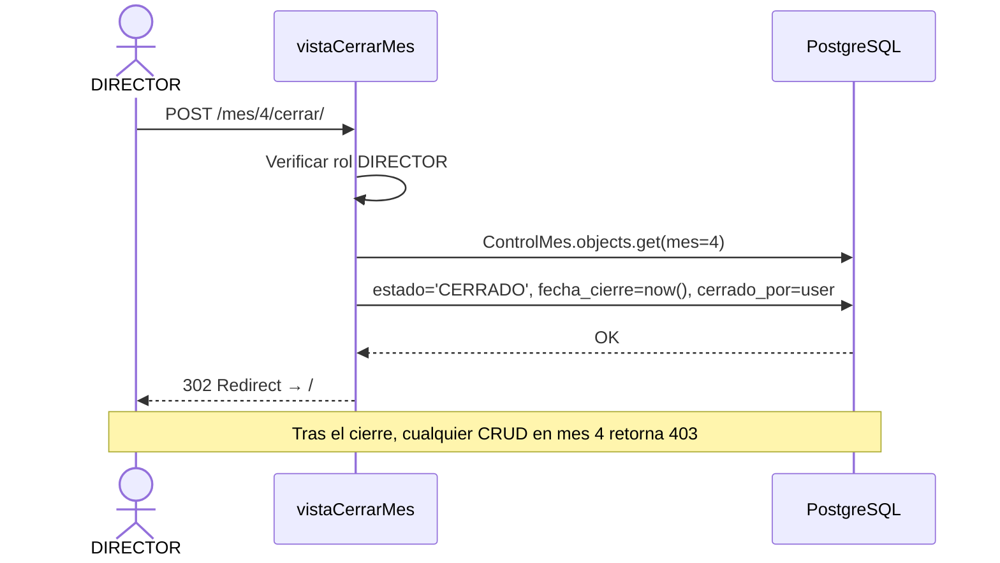
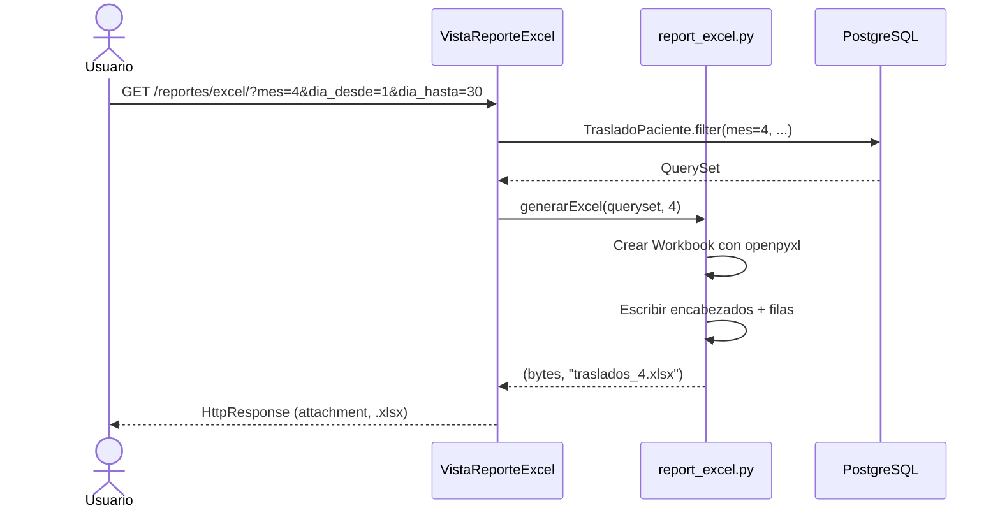
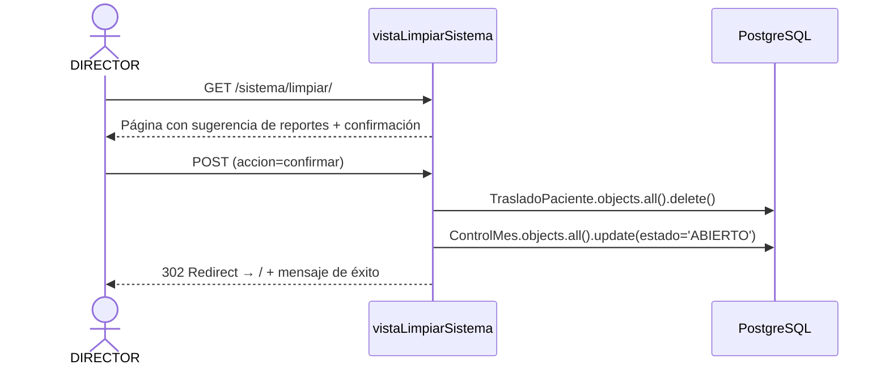
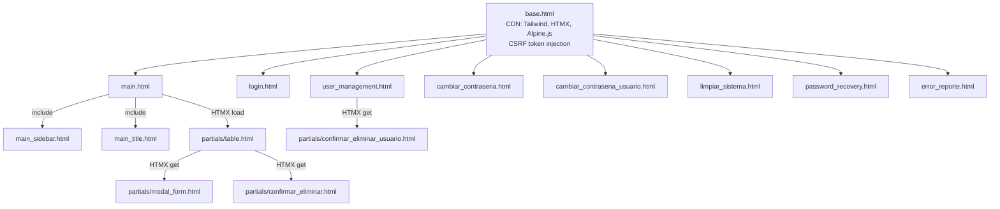
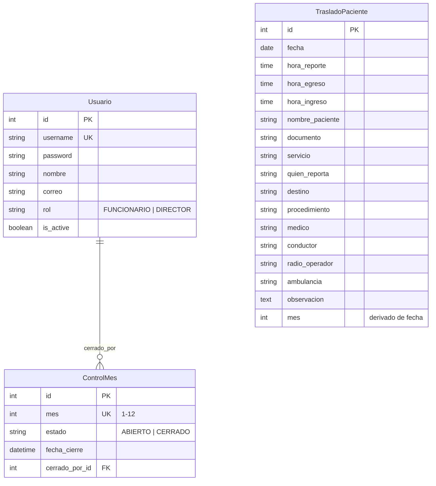

# Diagramas de Arquitectura

---

## 1. Arquitectura general del sistema

---

## 2. Flujo de autenticación

---

## 3. Flujo CRUD de traslados (HTMX)

---

## 4. Flujo de filtrado

---

## 5. Flujo de cierre de mes

---

## 6. Flujo de generación de reporte Excel

---

## 7. Flujo de limpieza anual

---

## 8. Relación de componentes (templates)

---

## 9. Modelo de datos (relaciones)

